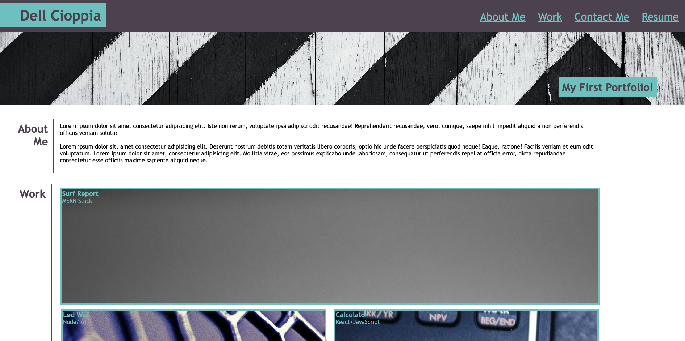

# BDC-Portfolio
This is my first portfolio!

## Motivation

My motivation with this project is to showcase my work to potential employers. I am proud of the work I have put in and hope it shows in the details. This portfolio and projects will help give examples and illistrations of the skills and coding languagues that I have learned to help fill a hiring need in a fast growing industry. 

## What does it solve and provide?
In today's digital time having a strong internet presense and dominance is one of the most important business asspects that can be meet with:

## Features
This webisite portfolio offers five examples of projects that I have finsihed with the help of UCF's coding bootcamp. The five examples showcase my ability with Mern Stack, Node, React, JavaSrcipt, HTML, CSS, and Mern Stack.         

 ## Installation 
 Clone the respository to your Github account and deploy the website once finished and approved code. 
 
 Website Link: https://github.com/BrandonDell/BDC-Portfolio

 ## Image
 

 ## Credits
 Brandon Dell Cioppia UCF Coding Student
 

 ## License
 N/A